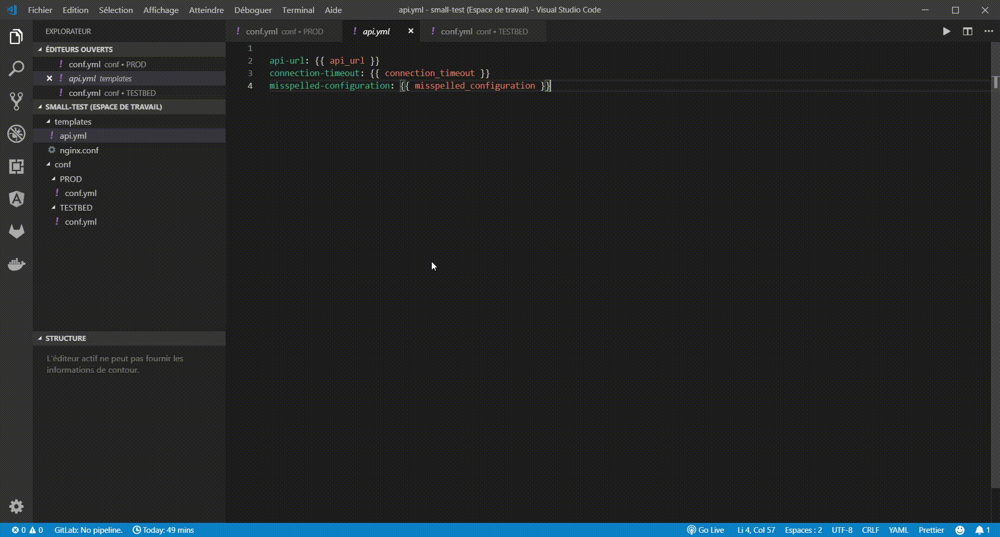

# Template Finder

This extension helps you manage your templated files by showing you the values of the different templated variables.

The best use-case would be to have a folder with templated files, and other ones with files containing the different possible values of the variables.

The templating format used is [Jinja](http://jinja.pocoo.org), used for example by [Ansible](https://ansible.com) playbooks.



## Getting started

> **Important** <br>
> The templated files and the variables values have to be in the same workspace.
> If not, please use [multi-root workspaces](https://code.visualstudio.com/docs/editor/multi-root-workspaces)

> **Requirements**<br>
> The configuration files have to be yaml files, with the `.yml` extension

### Activate

Run the VSCode command `Template Finder: Activate in this workspace`

<!--
Waiting for the issue

### Customize

By default all yaml files in the workspace are considered as sources for variables values.

If not you may want to use those settings:

```json
"templateFinder.variables.sourceFolders": [
    "configuration"
],
"templateFinder.variables.ignoredFolders": [
    "configuration/ignored"
]
``` -->

## Issues

If you notice any irregularities or have any idea on how to improve this extension, please open an issue on [Github](https://github.com/ArtyMaury/template-finder)
